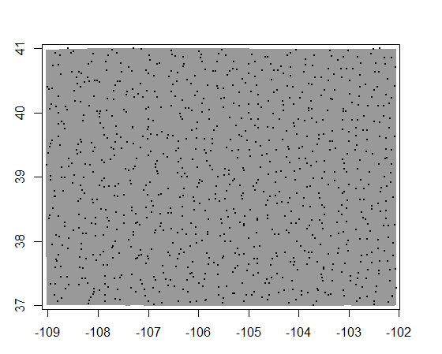
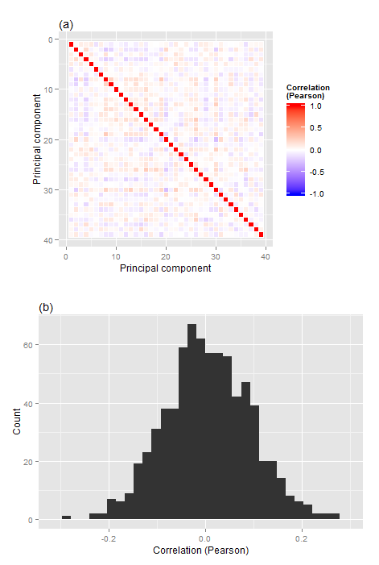
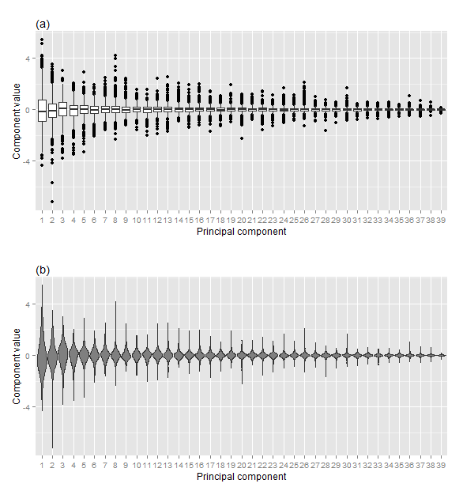

# Introduction
This user guide describes how library GcClust is used to cluster 
regional geochemical data. To this end, this guide describes how to use
the functions in package GcClust and how to evaluate the results returned by
those functions. 

The scope of this user guided is limited. It does not provide detailed 
descriptions of the function because this information is available with the
package Help. It does not describe the mathematics, which is the basis
for many functions; this description will be published separately. Finally, it
does not provide any information about the geochemical interpretation of 
clusters.

The goals of this user guide are most readily achieved by showing the 
step-by-step processing of a data set, so this package includes a 
regional geochemical data set.
The data set comprises measurements of 959 soil samples that were collected in 
the state of Colorado, United States of America. For each sample, 
the measurements
include the chemical concentrations of 39 elements. Additional information
about these data are listed under "CoGeochemData" in the package Help.

This user guide includes R-language scripts that are used to cluster the
Colorado data. We highly recommend that you copy these scripts into a
file and execute the scripts. This effort will
help you become familar with the processing and its analysis. Some details 
of your
processing results will differ from the results presented in this
user guide because of the random nature of the calculations. Nonetheless, 
the general features of your processing results will be the same.

The remainder of the user's guide is divided into XXXX sections:
[Structure of the data container],
[Preparatory steps],
[Data transformation and analysis], 
"Cluster computations," "Computation analysis,"
"Cluster visualization", "Splitting," and "Clustering with modes."

# Structure of the data container

The geochemical data is organized as a R-language list with three elements.

## First element

The first list element is called "concData", and it contains the geochemical concentrations and related information. The list element is a data container, 
which is called a `SpatialPointsDataFrame`. This container is defined in the
"sp" package and was designed specifically for spatial data. 
A SpatialPointsDataFrame comprises several sub-containers, which are fully described in the sp package documentation. Two sub-containers are 
especially important here. 

The first sub-container is an R-language data frame that stores
the geochemical concentrations for each field sample. Each row of this data 
frame pertains to one field sample, and the name of the row is the name of the
field sample. Each column pertains to one element, and the name of the column is the abbreviated name of the element (for example, "Al" or "Zn"). So, a row of 
the data frame comprises all element concentrations for one field 
sample, and a column of the data frame comprises the concentrations of
one element for all field samples. 

There are three requirements for the measured concentrations. First, the concentrations must not have any missing values. Second, concentrations that are left-censored (that is, below the lower limit of determination) must be replaced by an imputed concentrations. Finally, all concentrations must have the same units. Typically these units are "mg/kg", which is equivalent to "ppm".

The second sub-container is an R-language matrix that stores the spatial locations of the field samples. Each row of the matix pertains to one field sample and is associated with a corresponding row of the data frame. The matrix has two columns, which store the coordinates of the field samples. The coordinates are typically lattitude and longitude; the coordinates must have the same datum, which is typically the WGS84 datum.

## Second element
The second list element is called "censorIndicators", and it contains information about the censoring of the measured concentrations. The list element is an R-language array.  The structure of the array is identical to the structure of the data frame containing the concentrations: The array and the data frame have the same number of rows, the same number of columns, the same row names, and the same column names. Consequently, identifying the status of a particular concentration is easy. An array element may have two possible values: "no" meaning that the concentration is not censored and "left" meaning that the original concentration is left-censored and has been replaced by an imputed value.

## Third element
The third list element is called "constSumValue". Geochemical data sum to a constant value even if some element concentrations are not reported. For geochemical data, the constant sum value typically is 1000000 mg/kg or equivalently 1000000 ppm. In such cases, `constSumValue` equals 1000000.

# Preparatory steps

Create a directory named `Process1`, and set the working directory to 
`Process1`. Create a file named `ProcessScripts.R`; you should copy the R-language scripts from this user guide into this file and then execute them. 

Such a file is valuable
for at least two reasons. First, the file is a record of how the data
are processed; this record ensures that the processing is reproducible. Second, modifying a processing
step is relatively easy in most cases: Only the associated R-language script 
in the file is editted --- the other scripts remain unchanged.

Copy this code into file `ProcessScript.R` and then execute it.
```
library(GcClust)   # install package GcClust
library(sp)        # install package sp
library(maps)       # install package map

nPCs <- 21         # number of principal components

# order in which the elements are plotted
elementOrder <- c( "Sr", "U", "Y", "Nb", "La", 
                   "Ce", "Th", "Na", "Al", "Ga", 
                   "Be", "K", "Rb", "Ba", "Pb", 
                   "Cu", "Zn", "Mo", "Mg", "Sc", 
                   "Co", "Fe", "V", "Ni", "Cr", 
                   "Ca", "P", "Ti", "Li", "Mn", 
                   "Sn", "As", "Bi", "Cd", "In", 
                   "S",  "Sb", "Tl", "W")
```
The comments, which are preceded by `#`, describe either the purpose of the
R-language script or the meaning of the variables.
Variables `nPCs` and `elementOrder` are needed for the processing and
are fully described later in this guide.

Execute these scripts (but don't add them to file `ProcessingScripts.R`):
```
gcData <- CoGeochemData
save(gcData, file="gcData.dat")
```
The first script assigns the Colorado geochemical data to variable `gcData`.
The format of variable `gcData` is described in section [Structure of the data container]; additional information about the Colorado geochemical data is available under item "CoGeochemData" within the package Help. The second script writes `gcData` to binary file `gcData.dat` in the current directory. This operation is strictly unnecessary because these data are available within package GcClust. Nonetheless, this operation should be performed so that the processing steps within this guide are as close as possible to the steps that you will use when you process your own data.

To plot the locations of the field samples, copy this code into file `ProcessScript.R` and then execute it. (For the remainder of this guide, these "copy-and-execute" instructions are no long stated.)
```
load("gcData.dat")   # Load the binary file with the geochemical data

# plot the state as a gray polygon and then add axes 
map('state', regions = 'colorado', fill = TRUE, col = "gray60", border = "white")
map.axes()

# add the sample locations
plot( gcData$concData, add = TRUE, pch = 16, cex = 1/3, col = "black")
```



(You will notice that five samples are plotted just outside the northern and eastern borders. The likely cause of this apparent discrepancy is that the coordinate datum for Colorado border with package maps differs from the WGS84 datum for the sample locations.) This simple checks ensures that the data within gcData is in the correct format and is for the state of Colorado.

# Data transformation and analysis

The following code performs the data transformation.
```
# Apply the isometric log-ratio transform and the robust principal components 
# transform. 
transData <- transformGcData(ugDemo$concData)

# Save the transformed data in binary file "TransData.dat"
save(transData, file = "TransData.dat")     
```
The principal components, which are needed for the clustering, are stored in container `transData` along with other variables.

Function `transformGcData` has a second argument `alpha`, which is assigned a default value in the above scripts. Argument `alpha` is the fraction of the data that is used to calculate the mean vector and the covariance matrix; it may range from 0.50 to 1.00. Relative low values, near 0.50, are appropriate for data with high measurement error; whereas relatively high values, near 1.00, are appropriate for data with low measurement error. There is no formula for selecting a value; it is a matter of judgement. Our quality control analyses suggest that the geochemical concentrations in `CoGeochemData`, and hence in `gcData`, have low measurement error. Consequently, `alpha` is set to 0.98, which is its default value. 

Within `gcData` there are concentrations for 39 elements, so after the isometric log-ratio transformation there are 38 components. That is, the number of elements minus 1 equals the number of components. Hence, there are also 38 principal components.

The principal components are now analyzed graphically to check that they are properly computed and to select appropriate parameters for the clustering. 
```
# plot the correlation matrix and histogram of correlations
plotEdaCorr(transData)

# plot the scree plot
plotEdaVar(transData)    

# plot boxplots and violinplots of the principal components
plotEdaDist(transData)   
```



Both the correlation matrix and the histogram (Figure 2)
indicate that the correlations are small; this property is expected for principal components. As argument `alpha` for function `transformGcData` decreases, the correlations tend to increase slightly. 


The scree plot shows variances associated with the principal components. Above each bar is the “cumulative percentage of the total variance.” To understand this quantity, consider the variances for just the first three principal components, namely 1.742, 0.791, and 0.519. The cumulative variances are 1.742, 2.533, and 3.052. These cumulative variances are expressed as percentages of the total variance, which is 4.973. Thus, the cumulative percentages of the total variance are 35.03%, 50.94%, and 61.38%. These cumulative percentages mean that the first component accounts for 35.03% of the total variance, the first and second components for 50.94%, and the first, second, and third components for 61.38%. 

A suitable subset of principal components must be selected for the clustering. Our selection criterion is that the chosen components must account for most of the variance in the data, which is equivalent to most of the information in the data. Thus, the subset always includes the lower-order components, namely component 1, component 2, and so on. The relevant issue is determining the last component in the subset. There is no clear-cut method of resolving this issue, but the cumulative percentage of the total variance is helpful: The higher the cumulative percentage, the greater the amount of information that is used for the clustering. However, if the cummulative percentage is too high, then noise is included in the clustering. Our experience indicates that a suitable percentage ranges roughly from 75% to 95%. For this analysis, we chose a threshold of 96%, which corresponds to 21 principal components. Consequently, variable `nPCS` is set to 21.



The boxplots and the violinplots (Figure 4) show that the distributions for each component are centered at zero and that the spread of the distributions decreases and the component number increases. This behavior is expected for principal components. The distributions for each component are unimodal.

During the finite mixture modeling, two multivariate normal distributions are fit to the principal components. That is, for one distribution, a mean and a standard deviation are estimated for each component. Likewise, for the other distribution, a mean and a standard deviation are estimated for each component.

Approximate bounds for the estimated means can be determined from the boxplots (Figure 4). For a single component, both the estimated mean for one distribution and the estimated mean for the other distribution must be within the range of the component values. For example, the two estimated means must be between approximately -5.2 and 4.5 for component 1, between approximately -3.5 and 7.4 for component 2, and so on. 

Approximate bounds for the estimated standard deviations can be determined from the scree plot (Figure 3). For a single component, both estimated standard deviations must be less than standard deviation estimated from the scree plot. For example, the two estimated standard deviations must less than 1.32 for component 1, 0.89 for component 2, and so on.


# Modeling computations

# Analysis of computations

## Check for within-chain label-switching

## Select the chains and their switching

plotPointStats

Sometimes, but infrequently, the samples of the posterior pdf
are poorly representative a mode. For example, samples in short sections of
a trace may differ enormously from samples in other sections. The point
statistics for this trace differ
enormously from the point statistics for corresponding traces for other
chains.

If such spurious point statistics are used to calculate
plot ranges, then the resulting plot is difficult to analyze. To prevent this
problem, the spurious point statistics are not used to calculate the
plot ranges. The exclusion applies to all point statistics for the
associated chain, and the
chains are desigated by argument \code{excludedChains}. The resulting
plot will include the spurious point statistics, if it is within the plot
range.


The number of chains that should be combined is about 4.

## Combine the selected chains


## Check convergence

## Check the model

# Back transform to concentrations

# Cluster visualization

## Calculate simplex stats
Why?
What statistics

```
simplexStats <- calcSimplexStats(demoD$concData, demoD$kappa)
save(simplexStats, file = "SimplexStats.dat")
```


The plot depends stongly upon the set of geochemical concentrations
that are used to compute the standardization. Only those plots using the same standardization can be compared. This situation commonly occurs when the standardization is based on the field samples from the entire survey area. 

plotProbMap
The symbol colors, symbol sizes, and symbol type have been chosen so that the symbols are easily perceived when they are plotted on a gray background. Be careful when changing these parameters!
The default values work well, so the occasions to change them should be rare.


# Splitting the data set


---


Vignettes are long form documentation commonly included in packages. Because they are part of the distribution of the package, they need to be as compact as possible. The `html_vignette` output type provides a custom style sheet (and tweaks some options) to ensure that the resulting html is as small as possible. The `html_vignette` format:

- Never uses retina figures
- Has a smaller default figure size
- Uses a custom CSS stylesheet instead of the default Twitter Bootstrap style

## Vignette Info

Note the various macros within the `vignette` setion of the metadata block above. These are required in order to instruct R how to build the vignette. Note that you should change the `title` field and the `\VignetteIndexEntry` to match the title of your vignette.

## Styles

The `html_vignette` template includes a basic CSS theme. To override this theme you can specify your own CSS in the document metadata as follows:

    output: 
      rmarkdown::html_vignette:
        css: mystyles.css

## Figures

The figure sizes have been customised so that you can easily put two images side-by-side. 

```{r, fig.show='hold'}
plot(1:10)
plot(10:1)
```

You can enable figure captions by `fig_caption: yes` in YAML:

    output:
      rmarkdown::html_vignette:
        fig_caption: yes

Then you can use the chunk option `fig.cap = "Your figure caption."` in **knitr**.

## More Examples

You can write math expressions, e.g. $Y = X\beta + \epsilon$, footnotes^[A footnote here.], and tables, e.g. using `knitr::kable()`.

```{r, echo=FALSE, results='asis'}
knitr::kable(head(mtcars, 10))
```

Also a quote using `>`:

> "He who gives up [code] safety for [code] speed deserves neither."
([via](https://twitter.com/hadleywickham/status/504368538874703872))
