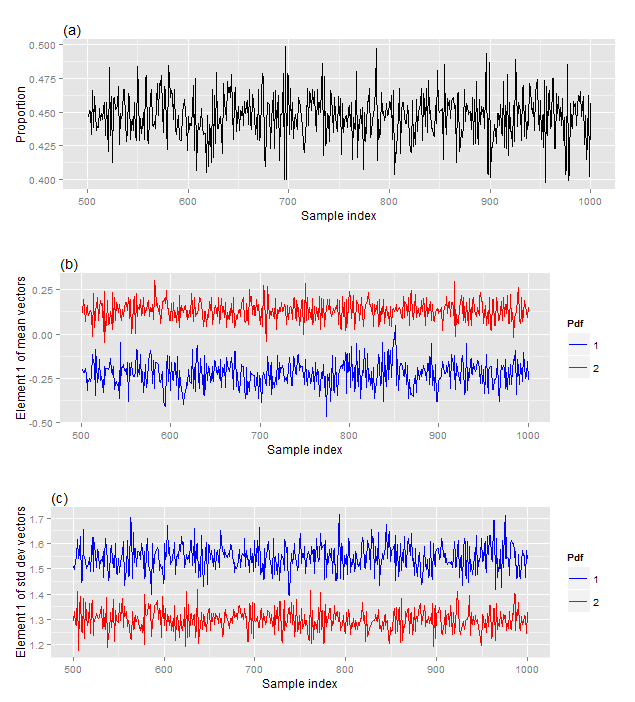
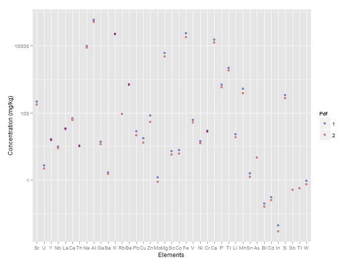

# Introduction
GcClust is a software package developed by the U.S. Geological Survey for statistical clustering of regional geochemical data, and similar data such as regional mineralogical data. Functions within the software package are written in the R statistical programming language, which is called either “R language” or “R” in this user’s guide. These functions, their documentation, and a copy of this user’s guide are bundled together in R’s unit of sharable code, which is called a “package.”

This user's guide describes how to use the functions in the GcClust package to cluster regional geochemical data and how to evaluate the results returned by those functions. So, this user’s guide provides an overview of the package, showing you how to use the functions to process your data. As an overview, the scope of this user's guided is limited. It does not provide detailed descriptions of the functions because this information is available in the package Help. It does not describe the mathematics of the finite mixture model, which is a key component of GcClust, because we are publishing this information elsewhere. 

We assume that you are familiar with the R language, Bayesian data analysis including Monte Carlo sampling, methods for analyzing compositional data such as geochemical data, and interpretation of geochemical data. If not, you may find information about R in R Core Team (2015), information about Bayesian data analysis in Gelman and others (2014), and information about compositional data analysis in Pawlowsky-Glahn and others (2015).

The goals of this user's guide are most readily achieved by showing the step-by-step processing of a data set, so this package includes a regional geochemical data set. The data set comprises measurements of 959 soil samples that were collected in the State of Colorado, United States of America. For each sample, the measurements include the chemical concentrations of 39 elements. Additional information about these data is available in "CoGeochemData" within the package Help.

This user's guide includes R-language scripts that are used to cluster the Colorado data. (To help you readily identify these scripts, they are typeset using the Courier New font. In addition, program variables, data structures, and so on are typeset with the Courier New font.) We encourage you to copy these scripts into a file and execute them. This effort will help you become familiar with the processing and its analysis. Some details of your processing results will differ from the results presented in this user's guide because of the random nature of the calculations. Nonetheless, the general features will be the same.

The remainder of the user's guide is divided into 6 major sections: [Organization of the geochemical data], [Preparatory steps], [Pre-processing and analysis], [Monte Carlo sampling], [Checking the model],  and [Splitting the geochemical data].

# Organization of the geochemical data

## First element

Your geochemical data must be organized as a R-language list with three elements. The first list element is called "concData", and it contains the geochemical concentrations and related information. This list element is a  `SpatialPointsDataFrame`, which is defined in the "sp" package and is designed specifically for spatial data. A SpatialPointsDataFrame comprises several data containers, which are fully described in the sp package documentation. Two data containers are especially important here. 

The first data container is an R-language data frame that stores the geochemical concentrations for each field sample. Each row of this data frame pertains to one field sample, and the name of the row is the name of the field sample. Each column pertains to one element, and the name of the column is the abbreviated name of the element (for example, "Al" or "Zn"). Therefore, a row of the data frame comprises all element concentrations for one field sample, and a column of the data frame comprises the concentrations of one element for all field samples. 

There are three requirements for the measured concentrations. First, the concentrations must not have any missing values. Second, concentrations that are left-censored (that is, below the lower limit of determination) must be replaced by imputed values. Finally, all concentrations must have the same units. Typically these units are milligrams per kilogram (mg/kg).

The second data container is an R-language matrix that stores the spatial locations of the field samples. Each row of the matix pertains to one field sample and is associated with a corresponding row of the data frame. The matrix has two columns, which store the coordinates of the field samples. The coordinates are typically lattitude and longitude; the coordinates must have the same datum, which is commonly the World Geodetic System 1984 (WGS84) datum.

## Second element
The second list element is called "censorIndicators", and it contains information about the censoring of the measured concentrations. The list element is an R-language array.  The structure of the array is identical to the structure of the data frame containing the concentrations: The array and the data frame have the same number of rows, the same number of columns, the same row names, and the same column names. Consequently, identifying the status of a particular concentration is easy. An array element may have two possible values: "no" meaning that the concentration is not censored, and "left" meaning that the original concentration is left-censored and has been replaced by an imputed value.

## Third element
The third list element is called "constSumValue". Geochemical data sum to a constant value even if some element concentrations are not reported. For geochemical data, the constant sum value typically is 1000000 mg/kg. In this case, the `constSumValue` equals 1000000.

# Preparatory steps

Using the Windows operating system, create a directory named `Process1`. For example, assume that the directory, including its path, is `F:\tmp\Process1`. Then, within the R session, set the working directory to `Process1`:
```
setwd(“F:\\tmp\\Process1\\GcClust”)
```
The double forward slashes are required for the Windows operating system. Then execute these scripts:
```
library(GcClust)
gcData <- CoGeochemData
save(gcData, file="gcData.dat")
```
The first script loads package `GcClust`. The second script assigns the Colorado geochemical data to variable `gcData`. The format of variable `gcData` is described in section [Organization of the geochemical data]; additional information about the Colorado geochemical data is available under item "CoGeochemData" within the package Help. The third script writes `gcData` to binary file `gcData.dat` in the working directory. This operation is strictly unnecessary because these data are available within package GcClust. Nonetheless, this operation should be carried out so that the processing steps within this guide are as close as possible to the steps that you will use when you process your own data.

Create a file named `ProcessScripts.R`. You should copy the R-language scripts from this user guide into this file and then execute them. Such a file is valuable for at least two reasons: First, the file is a record of how the data are processed; this record ensures that the processing is reproducible. Second, modifying a processing step is relatively easy in most cases; only the associated R-language script in the file is edited.

Copy the following code into file `ProcessScript.R` and then execute it. (For the remainder of this guide, these "copy-and-execute" instructions are not stated again.)
```
library(GcClust)   
library(sp)        
library(maps)      
library(shinystan) 
load("gcData.dat")
```
This code loads the needed libraries and the geochemical data.

To ensure that the geochemical data pertains to the area of interest, plot the locations of the field samples: 
```
# plot the state of Colorado as a gray polygon and then add axes 
map('state', regions = 'colorado', fill = TRUE, col = "gray60", border = "white")
map.axes()

# add the sample locations
plot( gcData$concData, add = TRUE, pch = 16, cex = 1/3, col = "black")
```


You will notice that five samples are plotted just outside the northern and eastern borders. The likely cause of this discrepancy is that the datum for the coordinates of the border, which are specified within package maps, differs from the WGS84 datum for the sample locations. This discrepancy is minor and has no effect on the processing.

# Pre-processing and analysis

Function `transformGcData` pre-processes the geochemical data:
```
transData <- transformGcData(gcData)

save(transData, file = "TransData.dat")     
```
The results are stored in container `transData` because they are needed for the clustering.

There are three different steps to the pre-processing. First, the concentrations for the missing elements are accounted for. Within `gcData` there are concentrations for 39 elements. Obviously, `gcData` is missing the concentrations of all other elements. The missing-element concentrations are collectively represented by a single value. For example, if the concentrations of the 39 elements for one field sample sum to 97,634 mg/kg, then the sum of the missing-element concentrations must be 1,000,000 - 97,634 mg/kg, which equals 902366 mg/kg. So, 902366 mg/kg is used to collectively represent all of the missing-element concentrations for this field sample. Collective, missing-element concentrations are calculated for all field samples, are assigned the name "EE" meaning "everything else", and are appended to the element concentrations. Consequently, the number of effective element concentrations is now 40.

Second, the geochemical data with the appended, missing-element concentrations are transformed using the isometric log-ratio (ilr) transform. A consequence of this transform is that the dimension is reduced by 1, so now there are 39 ilr coordinates. Third, the ilr coordinates are transformed with the principal components transform. This transform does not change the dimension---there are still 39 principal components.

Function `transformGcData` has a second argument `alpha`, which is assigned a default value in the above scripts. Argument `alpha` is the fraction of the data that is used to calculate the mean vector and the covariance matrix; it may range from 0.50 to 1.00. Relative low values, near 0.50, are appropriate for data with high measurement error whereas relatively high values, near 1.00, are appropriate for data with low measurement error. There is no formula for selecting an appropriate value---it is a matter of judgement. Quality control analyses, which USGS personnel have carried out on the geochemical data, indicate that the geochemical concentrations in `CoGeochemData`, and hence in `gcData`, have relatively low measurement error. Consequently, `alpha` is chosen to be 0.98, which happens to be its default value. 


The principal components are analyzed graphically to check that they are properly computed and to select appropriate parameters for the clustering. Check the distributions of the principal components:
```
# plot boxplots and violin plots of the principal components
plotEdaDist(transData)   
```

![Figure 2. (a) Boxplots and (b) violin plots of the principal components. In a boxplot, the three horizontal lines correspond to the 0.25, 0.50 and 0.75 quantiles. The upper whisker extends from the 0.75 quantile to the highest value that is within 1.5 times the interquartile range of the 0.75 quantile. The lower whisker extends from the 0.25 to the lowest values that is within 1.5 times the interquartile range of the 0.25 quantile. Data values beyond the end of a whisker are plotted as points. (Wickham, 2009)](figures/EdaDist.png)

The boxplots and the violinplots (Figure 2) show that the distributions for each component are centered at zero and that the spread of the distributions decreases as the component number increases. This behavior is expected for principal components. For these data, the distributions for each component are unimodal.

Check the correlations among the principal components:
```
# plot the correlation matrix and histogram of correlations
plotEdaCorr(transData)
```


Both the correlation matrix and the histogram (Figure 3) indicate that the correlations are small; this property is expected for principal components. As argument `alpha` for function `transformGcData` decreases, the correlations tend to increase slightly. 

Check the variances of the principal components using a scree plot:
```
# plot the scree plot
plotEdaVar(transData)
```


Above each bar in the scree plot (Figure 4) is the “cumulative percentage of the total variance.” To understand this quantity, consider the variances for just the first three principal components, namely 1.795, 0.797, and 0.538. The cumulative variances are 1.795, 2.592, and 3.130. These cumulative variances are expressed as percentages of the total variance for all of the components, which is 5.097. Thus, the cumulative percentages of the total variance are 35.22 percent, 50.86 percent, and 61.41 percent. These cumulative percentages mean that the first component accounts for 35.22 percent of the total variance, the first and second components for 50.86 percent, and the first, second, and third components for 61.41 percent. 

A suitable subset of principal components must be selected for the clustering. Our selection criterion is that the chosen components must account for most of the variance in the principal components, which is equivalent to most of the information in the geochemical concentrations. Thus, the subset always includes the lower-order components, namely component 1, component 2, and so on. The relevant issue is determining the last component in the subset. There is no clear-cut method of resolving this issue, but the cumulative percentage of the total variance is helpful: The higher the cumulative percentage, the greater the amount of information that is used for the clustering. However, if the cummulative percentage is too high, then noise is included in the clustering. Our experience indicates that a suitable percentage ranges roughly from 75 percent to 95 percent. For this analysis, we chose a threshold of 96 percent, which corresponds to 22 principal components. Consequently, variable `nPCs` is set to 22:
```
# number of principal components
nPCs <- 22         
```

# Monte Carlo sampling 
## Sampling
The Monte Carlo sampling of the posterior probability density function is performed by package rstan using a previously compiled object. If you have a Windows operating system, then the object is already compiled and stored in the file "GcClust\\stan\\MixtureModel.bin" within the R library directory. It is loaded into the R session with the following code:
```
tmp <- normalizePath(path.package("GcClust"))
load(paste(tmp, "\\stan\\MixtureModel.bin", sep=""))
```
The name of the object is "sm" because it a stan model. If you have another operating system, then you must compile the object yourself. To this end, file "GcClust\\stan\\CompileStan.R" within the R library directory should be helpful.

The sampling is performed by function sampleFmm:
```
priorParams <- c(4, 3, 3, 2)
samplePars <- sampleFmm(transData, nPCs, sm, priorParams, 
                        nChainsPerCore = 5, nCores = 7)

save(samplePars, file = "SamplePars.dat")
```
Function argument `priorParams` comprises the parameters for the prior probability density functions and is fully described in the package Help. Function argument `nCores` specifies that seven processor cores will be requested from the operating system. Of course, the number of processors that you request must be less than or equal to the number on your computer. Function argument `nChainsPerCore` specifies that five separate sampling chains will be computed by each core. So, a total of 35 chains are computed. Our experience is that many chains (for example, 35 chains) are needed to sample the posterior probability density function because it usually has multiple modes.

The chains are not returned by function `sampleFmm` because they would require too much computer memory. Instead, the chains are written to the computer disk in the directory specified by argument `procDir`, for which the default value is the working directory. The file names have the form "RawSamples?-?.dat", for which the first and second question marks are replaced by the processor number and the chain number respectively.

The time that function `sampleFmm` needs to complete the computations depends upon many factors including the number of chains for each processor, the number of field samples, and the number of principal components. When we processed these data, the time was approximately 2.5 hours.

## Checking parameter traces for each chain

The analysis of the Monte Carlo samples begins by checking the parameter traces for each chain. The number of model parameters, and hence the number of parameter traces, equals $N^2 + 3N + 1$ where $N$ is the number of principal components. For the example in this vignette, the number of principal components is 22, so the number of parameter traces is 551. Examining 551 parameter traces for 35 chains would be overwhelming, so only a subset of 5 parameter traces is examined for each chain. The 5 model parameters are the proportion, element 1 of the mean vector for pdf 1, element 1 of the mean vector for pdf 2, element 1 of the standard deviation vector for pdf 1, and element 1 of the standard deviation vector for pdf 2. These 5 parameter traces are plotted for all 35 chains with the following code
```
plotSelectedTraces(samplePars)
```



Each trace should appear stationary---the trace should consist of random fluctuations having a constant mean and a constant standard deviation. The two traces for element 1 of two mean vectors should not switch with one another. Likewise, the two traces for element 1 of two standard deviation vectors should not switch with one another. If the traces do not satisfy these criteria, then the sampling of the posterior pdf must be modified. The modifications are described in the documentation for function `sampleFmm`.

You may notice switching between chains. For example, the proportion could be 0.44 for chain 1 and 0.56 for chain 2. Associated with this switch in proportion are corresponding switches for the other four model parameters. Such switching is common and normal. 

## Selecting the chains

Another component of the analysis is checking point statistics for the model parameters for every chain. Again, for the example in this vignette, there are 551 model parameters, and examining point statistics for these 551 parameters would be overwhelming. Therefore, a subset is examined; the subset comprises the five model parameters that were discussed in the previous section and natural logarithm of the likelihood. These statistics are plotted with the following code
```
plotPointStats(samplePars)
```


If you examine the point statistics for the log-likelihood (Figure 6d), the median log-likelihoods are either approximately -7,320 or -7,410. This result suggests that two modes in the posterior pdf were sampled. The log-likelihood indicates how well the model fits the data---higher values indicate a better fit than lower values do. Consequently, it is tempting to select the mode, and hence the chains, associated with the highest log-likelihood. Our experience suggests that this approach is incorrect---all modes should be investigated because some modes yield a better geochemical interpretation than other modes do. For the rest of this vignette, the mode associated with the log-likelihood of approximately -7,320 is called "the first mode," and the mode associated with the log-likelihood of approximately -7,410 is called "the second mode."

For the first mode, chains 1, 2, 3, and 4 are selected for a complete analysis. Now examine the point statistics for variable proportion (Figure 6c). The median values of proportion are approximately 0.44, 0.56, 0.44, and 0.56 for chains 1, 2, 3, and 4. This result indicates that chains 2 and 4 are switched relative to chains 1 and 3. This switch is apparent also in the point statistics for element 1 of the mean vectors and element 1 of the standard deviation vectors. Again, this switch is normal.

For the second mode, chains 13 and 33 are selected for a complete analysis. Of course, only these two chains sampled this mode. The median values of proportion are both approximately 0.54, indicating that the chains are not switched relative to one another.

The number of selected chains should range between two and four. If there is just one chain, then the statistics that are used to check convergence (which is discussed later) are unreliable. If there are four chains, the statistics are very reliable; five or more chains do not significantly improve the reliability.

On rare occasions, the samples in a chain have a large variance. As a consequence, the vertical axes in Figure 6 are greatly expanded, making it difficult to analyze the four graphs. To overcome this difficulty, the spurious chain is excluded from the range calculation using argument `excludedChains`. However, the statistics for this chain are still plotted.

## Combining the selected chains

In the previous section, for the first mode, we selected chains 1, 2, 3, and 4 for complete analysis, and we determined that chains 2 and 4 must be switched relative to chains 1 and 3. A simple way to archive this information is to store it in a common-separated value file:
```
Chain,isSwitched
1,F
2,T
3,F
4,T
```
The file consists of two columns. The first column specifies the number of the chain that is selected, and the second column specifies whether the parameters in the chain are switched. "T" (TRUE) indicates that they are switched; "F" (FALSE) indicates that they are not. 

The following code reads the common-separated value file, switches the chains if needed, and then combines them.
```
selectedChains <- read.csv("SelectedChains.csv", header = TRUE,
                           stringsAsFactors = FALSE)
combinedChains <- combineChains(samplePars, selectedChains)
save(combinedChains, file = "CombinedChains.dat")
```
The returned object `combinedChains` contains the four selected chains, using the format specified in the rstan package.

## Checking convergence

The convergence of the Monte Carlo sampling is evaluated with another package called "shinystan". The following code launches an application in your web browser.
```
launch_shinystan(combinedChains)
```
With this application, you can view various graphical and statistical summaries that indicate how well the sampling converged. Interpretation of these summaries is beyond the scope of the vignette; information on topic is available in Hoffman and Gelman (2011), Gelman and others (2014, p. 281-288) and Stan Development Team (2015). Some information also is available within application shinystan.

# Checking the model

## Model fit to data

The mean vectors, the standard deviation vectors, and the correlation matrices for the two pdfs in the finite mixture model may be checked by comparing them to equivalent statistics calculated from the principal components. To this end, it is necessary to calculate the conditional probability that a field sample is associated with pdf 1 in the finite mixture model. This calculation is carried out with the following code:
```
condProbs1 <- calcCondProbs1(transData, nPCs, combinedChains)
save(condProbs1, file = "CondProbs1.dat")
```
Container `condProbs1` is a matrix containing the Monte Carlo samples of the conditional probabilities and is described further in the package Help. 

These conditional probabilities, along with the principal components, are used to calculate the mean vectors, the standard deviation vectors, and the correlation matrices for both pdfs in the finite mixture model. These statistics are called "observed test statistics" (Gelman and others, 2014, p. 145-146) because they are calculated from the observed data, which are the first 22 principal components. This calculation is carried out with the following code:
```
obsTestStats <- calcObsTestStats(transData, nPCs, condProbs1)
save(obsTestStats, file = "ObsTestStats.dat")
```

For Bayesian model checking, the observed test statistics are compared to replicated test statistics (Gelman and others, 2014, p. 143-153), which are derived from the samples of posterior pdf. For this application, the replicated test statistics are just the Monte Carlo samples of the mean vectors, the standard deviation vectors, and the correlation matrices. For the vectors, the comparison is carried out with the following code:
```
plotTMeanSd(combinedChains, obsTestStats)
```


In Figure 7, the distribution of the Monte Carlo samples for one model parameter (for example, element 1 of the mean vector for pdf 1) is summarized by the median and the 95 percent credible interval. The associated test statistic should be within the 95 percent credible interval, and ideally it should be close to the median. That is, the red dot should be within the interval defined by the vertical black line, and ideally it should be close to the horizontal black line. Along the top of Figure 7 are the posterior predictive p-values (Gelman and others, 2014, p. 146), which quantify the relation between the observed test statistic and the distribution of the replicated test statistic.

For the correlation matrices, the comparison between the test statistics is carried out with the following code:
```
plotTCorr(combinedChains, obsTestStats)
```


One part of the model check (Figure 8a and 8c) involves a matrix that combines an upper triangle and a lower triangle. The upper triangle is the upper triangle of the correlation matrix that is calculated from the principal components. The lower triangle is the lower triangle of the correlation matrix that is the median of its Monte Carlo samples. Consequently, an element in the upper triangle should be compared to the corresponding element in the lower triangle. For both pdfs, corresponding elements appear the same. The other part of the model check (Figure 8b and 8d) is a graphical display of the posterior predictive p-values for the off-diagonal elements of the correlation matrix. Because of the symmetry in the correlation matrix, only the p-values for, say, the upper triangle must be displayed. The color scale ranges from the smallest p-value to 0.5, which is the largest possible p-value. For both pdfs, the p-values are moderate to large. 

The model checks of the mean vectors, the standard deviation vectors, and the correlation matrices (Figures 7 and 8) show that the model fits the data for the first mode. For the second mode, the results of model checks are very similar, so they are not discussed. 

## Model fit to geologic knowledge

### Transforming back to the simplex

For each pdf in the finite mixture model, the samples of its mean vector, its standard deviation vector, and its correlation matrix are transformed to equivalent quantities in the simplex, namely, samples of the compositional center and the variation matrix. This transformation is carried out with the following code:
```
simplexModPar <- backTransform(gcData, nPCs, transData, combinedChains)
save( simplexModPar, file = "SimplexModPar.dat")
```

### Cluster visualization

#### Setting the plotting order of the elements

The order in which the elements are plotted is specified by a vector:
```
elementOrder <- c( "Sr", "U", "Y", "Nb", "La", 
                   "Ce", "Th", "Na", "Al", "Ga", 
                   "Be", "K", "Rb", "Ba", "Pb", 
                   "Cu", "Zn", "Mo", "Mg", "Sc", 
                   "Co", "Fe", "V", "Ni", "Cr", 
                   "Ca", "P", "Ti", "Li", "Mn", 
                   "Sn", "As", "Bi", "Cd", "In", 
                   "S",  "Sb", "Tl", "W", "EE")
```
The elements are specified by their common chemical abbreviations. Notice that the first letter is capitalized, and that the second letter (if any) is not. Using this vector, you can readily change the element order to improve cluster visualization.

#### Plotting the compositional centers

The compositional center is a vector, in which each vector element corresponds to a chemical element. The Monte Carlo samples of this vector comprise Monte Carlo samples of each vector element, namely samples of the mean concentration of a chemical element. These samples are summarized by their median. (The compositional operation of closure is not applied to these medians.) The medians for both pdfs in the finite mixture model are plotted in the order specified by vector `element order`:
```
plotCompMeans(simplexModPar, elementOrder)
```



The concentration for everything else "EE" is missing from this plot, which is the default for this function. This plot is useful for at least two reasons. First, the compositional centers are expressed in terms of concentrations making it relatively easy to interpret them. Second, this plot can be directly compared to similar plots of compositional centers. In contrast, plots of standardized compositional centers, which are discussed next, may be compared only in certain cases. 

In this plot, the range of the element concentrations is very large, so it is sometimes difficult to discern how the compositional centers differ between the two pdfs. Moreover, it is desirable to add information to the plot about the distribution of the Monte Carlo samples, but this cannot be done easily because the range of the distribution is very small compared to the vertical axis. 

Both difficulties are overcome by translating the compositional centers, which involves a simplex operation called "perturbation difference" (Pawlowsky-Glahn and others, 2015, p. 25). The composition that is used for the perturbation difference is the sample center for all field samples from the geochemical survey (Pawlowsky-Glahn and others, 2015, p. 66). This sample center is computed with function `calcSimplexStats`:
```
simplexStats <- calcSimplexStats(gcData)
save(simplexStats, file = "SimplexStats.dat")
```
It is helpful to interpret the operation of perturbation difference as a translation within the simplex. So, this simpler term is used from now on.
Function `plotTransCompMeans` uses the simplex statistics to perform the translation and then plot it:
```
plotTransCompMeans( simplexModPar, simplexStats, gcData, elementOrder)
```


The translated center for everything else "EE" is missing from this plot, which is the default for this function. For each chemical element, the median and the 95 percent credible interval summarize the distribution of its translated center. This plot readily shows how the translated compositional centers change between pdfs 1 and 2. For example, this plot shows that element indium (In) is much higher in pdf 1 than it is in pdf 2. This information may be combined with the spatial distribution of the clusters, greatly facilitating the interpretation of the geochemical data. This plot depends upon the sample center that is used for the translation, so it can be compared only to other plots for which the same sample center is used for the translation.


#### Plotting the scaled variation matrices

Monte Carlo samples of the variation matrix comprise Monte Carlo samples of its matrix elements. The samples of each matrix element are summarized by their median. This variation matrix with the medians is symmetric with respect to its diagonal. To prevent redundancy, the upper triangle of the variation matrix for pdf 1 and the lower triangle of the variation matrix for pdf 2 are combined into a single matrix. The combined variation matrix is plotted:
```
plotSqrtVarMatrices( simplexModPar, elementOrder, colorScale = "spectrum" )
```


The range of the variances in the matrix may be large, so the variances are scaled by the square root function. Consequently, the pixels in the Figure 11 represent standard deviations of the log-ratios between the respective chemical elements. Again, the order of the elements is specified by vector `element order`. The standard deviations associated with everything else "EE" are missing from this plot, which is the default for this function.

#### Mapping the clusters

The conditional probabilities that the field samples are associated with pdf 1 were calculated in subsection [Model fit to data]. A map showing the spatial distribution of these associations is very helpful when interpreting the geochemical data. To this end, the conditional probabilities must be grouped into meaningful categories. 

We have found that four categories are useful for interpretation. The first category indicates a strong association with pdf 1 and comprises those field samples for which the median conditional probabilities range from 0.9 to 1.0. The second category indicates a moderate association with pdf 1 and comprises those field samples for which the median conditional probabilities range from 0.5 to 0.9. The third category indicates a moderate association with pdf 2 (namely, a weak association with pdf 1) and comprises those field samples for which the median conditional probabilities range from 0.10 to 0.5. The fourth category indicates a strong association with pdf 2 (namely, a very weak association with pdf 1) and comprises those field samples for which the median conditional probabilities range from 0.0 to 0.1. These categories define clusters of the field samples, which are plotted:
```
map('state', regions = 'colorado', fill = TRUE, col = "gray60", border = "white")
map.axes()
plotClusters(gcData, condProbs1, symbolSizes = rep.int(2/3, 4))
```


The number of categories and the related intervals of the median conditional probability are specified in argument `probIntervals` of function `plotClusters`. Likewise, the plot symbols, their sizes, and their colors may also be changed. However, we have found that the default values for these arguments work well for many maps.

# Splitting the geochemical data

The field samples in each cluster may be processed to find finer-scale clusters. To this end, the field samples must be split, and this operation is accomplished with function `splitGcData`: 
```
theSplits <- splitGcData(gcData, condProbs1, threshold = 0.10 )
```
The splitting is based on argument `threshold`: Field samples for which the median conditional probability is between 1 and 1-threshold (namely, field samples strongly associated with pdf 1) comprise one group, and their data container is named `gcData1`. Field samples for which the median conditional probability is between 0 and threshold (namely, field samples strongly associated with pdf 2) comprise the other group, and their data container is named `gcData2`. Field samples for which the median conditional probability is between threshold and 1-threshold are omitted. We have found that a suitable value for argument `threshold` is approximately 0.1, which is its default value.

Both `gcData1` and `gcData2` are organized as described in section [Organization of the geochemical data]; consequently, they are ready for further processing. Both are returned by function `splitGcData` as elements in an R-language list.  

The next step is to create new directories. For this example, we name our directories "Process11" and "Process12" because they are derived from "Process1" and pertain to pdfs 1 and 2, respectively. The geochemical data are written into these directories using the following code: 
```
# Beware: this overwrites gcData !!!
gcData <- theSplits$gcData1
save( gcData, file = "..\\Process11\\gcData.dat" )

# Beware: this overwrites gcData !!!
gcData <- theSplits$gcData2
save( gcData, file = "..\\Process12\\gcData.dat" )
```
Observe that both list elements are renamed `gcData` so that the R-language scripts, that are used for processing, do not need editing. The geochemical data in "Process11" and "Process12" are clustered by applying the clustering procedure that already has been described in this user's guide.

# Acknowledgments
This work was funded by the Geochemical Landscapes Project within the Mineral Resources Program of the U.S. Geological Survey. 

# References cited

Hoffman, M.D., and Gelman, A.Andrew, 2011, The no-U-turn sampler—Adaptively setting path lengths in Hamiltonian Monte Carlo: The Journal of Machine Learning Research, v. 15, is. 1, p. 1593–1623, accessed November 2015 at http://arxiv.org/abs/1111.4246. 

Gelman, Andrew, Carlin, J.B., Stern, H.S., Dunson, D.B., Vehtari, Aki, and Rubin, D.B., 2014, Bayesian data analysis (3rd ed.):Boca Raton, Chapman and Hall/ CRC Press, 675 p.

Pawlowsky-Glahn, Vera, Egozcue, J.J., and Tolosana-Delgado, Raimon, 2015, Modeling and analysis of compositional data: Chichester, U.K., John Wiley and Sons, Ltd., 272 p.

R Core Team, 2015, An introduction to R: R Foundation for Statistical Computing, Vienna, Austria: Vienna University of Economics and Business, hosted by the Institute for Statistics and Mathematics of Wirtschafts University, accessed January 2016 at https://cran.r-project.org/doc/manuals/r-release/R-intro.html.

Stan Development Team, 2015, Stan Modeling Language—User’s guide and reference manual, version 2.8.0: Stan Development Team, accessed October 2015 at http://mc-stan.org/.

Wickham, Hadley, 2009, ggplot2–Elegant graphics for data analysis: New York, Springer Science+Business Media, LLC, 212 p.

